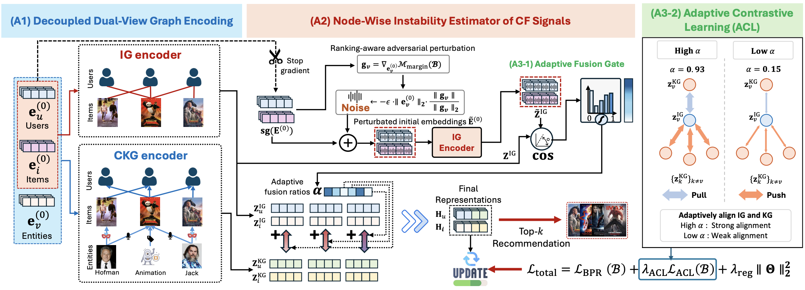

# AdaKG
> **Do All Nodes Benefit Equally from Knowledge Graphs? Adaptive Node-Aware KG Fusion for Recommendation**

This repository provides the implementation of **AdaKG (Adaptive Node-Aware KG Fusion)** for KG-aware recommendation.
- Jaehyun Park, Minseo Jeon, Daewon Gwak, Sunuk Kim, Hanvit Lee, and Jinhong Jung  
ACM International Conference on Information and Knowledge Management 2026 (CIKM '26)




## 🗂️ Repository Structure
The repository is organized as follows:
```
├── dataset/             # Processed datasets
├── log/                 # Training and evaluation logs
├── recbole/             # RecBole 1.1.1 source code
├── yaml/                # Dataset-specific hyperparameter configs
├── model/
│   └── AdaKG.py         # AdaKG model implementation
├── main.py              # Entry point
├── trainer/         
│   └── adakg_trainer.py # AdaKG Trainer
└── requirements.txt
```

## ⚙️ Prerequisites
The following commands create a conda environment and install the required packages:

```bash
conda create -n adakg python=3.9 pip=23.3 -y
conda activate adakg

# Install PyTorch and torch-scatter with the appropriate CUDA version for your environment.
pip install torch==2.2.2 --index-url https://download.pytorch.org/whl/cu121
pip install torch-scatter==2.1.2 -f https://data.pyg.org/whl/torch-2.2.2+cu121.html

pip install -r requirements.txt
```

> **Note:** We used a workstation equipped with an AMD 5955WX processor, 256GB RAM, and an NVIDIA RTX 4090 GPU (24GB VRAM), running PyTorch 2.2.2 and CUDA 12.1.

## 📚 Datasets
The statistics of the four real-world datasets used in the paper are summarized below.

| Datasets | Amazon-Book | MovieLens-1M | Book-Crossing | Last-FM |
|:--|--:|--:|--:|--:|
| **#Users** | 20,347 | 6,039 | 11,018 | 1,873 |
| **#Items** | 4,230 | 3,499 | 9,059 | 3,847 |
| **#Inter.** | 234,323 | 573,637 | 24,644 | 21,173 |
| **Density** | 0.27% | 2.71% | 0.02% | 0.29% |
| **#Entities** | 12,230 | 77,799 | 77,904 | 9,367 |
| **#Relations** | 21 | 51 | 27 | 62 |
| **#Triplets** | 46,522 | 378,151 | 151,500 | 15,518 |

The processed datasets are provided in the `dataset/` directory. Each dataset consists of an interaction graph (IG) and a knowledge graph (KG), following the RecBole atomic file format (`.inter`, `.kg`, `.link`).

## ♻️ Training and Evaluation
You can train and evaluate AdaKG on each dataset using the command below. Dataset-specific hyperparameters are provided in the `yaml/` directory and are automatically loaded for each dataset.

```bash
# Amazon-Book
python main.py --dataset Amazon-book

# MovieLens-1M
python main.py --dataset ml-1m

# Last-FM
python main.py --dataset lastfm

# Book-Crossing
python main.py --dataset book-crossing
```

## 📈 Experimental Results
### Recommendation performance
The reported results in the paper are as follows. The best results are in **bold**. The number in parentheses indicates the rank of each method within the corresponding column.

| **Recall@10** | **Amazon-Book** | **MovieLens-1M** | **Book-Crossing** | **Last-FM** | **Avg. Rank** |
|:--|:--:|:--:|:--:|:--:|:--:|
| LightGCN | 0.1980 (8) | 0.1855 (7) | 0.0468 (13) | 0.2695 (5) | 8.25 |
| CFKG | 0.1968 (10) | 0.1862 (5) | 0.0802 (6) | 0.2444 (10) | 7.75 |
| CKE | 0.1979 (9) | 0.1848 (9) | 0.0313 (15) | 0.2453 (9) | 10.50 |
| RippleNet | 0.1561 (12) | 0.1590 (15) | 0.0445 (14) | 0.1633 (15) | 14.00 |
| MCRec | 0.1524 (14) | 0.1610 (12) | 0.0512 (11) | 0.2132 (13) | 12.50 |
| KGCN | 0.1550 (13) | 0.1594 (13) | 0.0867 (5) | 0.2149 (12) | 10.75 |
| KGNN-LS | 0.1508 (15) | 0.1592 (14) | 0.0731 (8) | 0.2117 (14) | 12.75 |
| KGAT | 0.1925 (11) | 0.1830 (11) | 0.0499 (12) | 0.2583 (6) | 10.00 |
| KGIN | 0.2090 (3) | 0.1969 (3) | 0.0801 (7) | 0.2727 (3) | 4.00 |
| MCCLK | 0.2025 (7) | 0.1853 (8) | 0.0607 (9) | 0.2699 (4) | 7.00 |
| KGRec | 0.2035 (6) | 0.1960 (4) | 0.1033 (3) | 0.2560 (7) | 5.00 |
| DiffKG | 0.2039 (4) | 0.1846 (10) | 0.0581 (10) | 0.2520 (8) | 8.00 |
| CL-SDKG | 0.2036 (5) | 0.1861 (6) | 0.0924 (4) | 0.2409 (11) | 6.50 |
| LightKG | 0.2148 (2) | 0.2039 (2) | **0.1144** (1) | 0.2976 (2) | 1.75 |
| **AdaKG** | **0.2269** (1) | **0.2111** (1) | 0.1112 (2) | **0.3053** (1) | **1.25** |


| **MRR@10** | **Amazon-Book** | **MovieLens-1M** | **Book-Crossing** | **Last-FM** | **Avg. Rank** |
|:--|:--:|:--:|:--:|:--:|:--:|
| LightGCN | 0.1052 (8) | 0.3453 (8) | 0.0198 (13) | 0.1204 (5) | 8.50 |
| CFKG | 0.0987 (11) | 0.3405 (12) | 0.0384 (7) | 0.1100 (9) | 9.75 |
| CKE | 0.1037 (9) | 0.3457 (6) | 0.0152 (15) | 0.1069 (10) | 10.00 |
| RippleNet | 0.0838 (12) | 0.3062 (14) | 0.0194 (14) | 0.0656 (15) | 13.75 |
| MCRec | 0.0791 (13) | 0.3233 (13) | 0.0241 (11) | 0.0941 (12) | 12.25 |
| KGCN | 0.0738 (15) | 0.3456 (7) | 0.0433 (5) | 0.0924 (13) | 10.00 |
| KGNN-LS | 0.0750 (14) | 0.3051 (15) | 0.0371 (8) | 0.0891 (14) | 12.75 |
| KGAT | 0.0997 (10) | 0.3412 (11) | 0.0233 (12) | 0.1152 (7) | 10.00 |
| KGIN | 0.1099 (5) | 0.3551 (4) | 0.0399 (6) | 0.1242 (3) | 4.50 |
| MCCLK | 0.1065 (7) | 0.3474 (5) | 0.0359 (9) | 0.1228 (4) | 6.25 |
| KGRec | 0.1094 (6) | 0.3570 (3) | 0.0540 (2) | 0.1118 (8) | 4.75 |
| DiffKG | 0.1116 (4) | 0.3428 (9) | 0.0318 (10) | 0.1192 (6) | 7.25 |
| CL-SDKG | 0.1134 (3) | 0.3428 (9) | 0.0532 (3) | 0.1054 (11) | 6.50 |
| LightKG | 0.1172 (2) | 0.3767 (2) | 0.0520 (4) | 0.1351 (2) | 2.50 |
| **AdaKG** | **0.1208** (1) | **0.3848** (1) | **0.0552** (1) | **0.1398** (1) | **1.00** |

### Training logs
Training logs are available in the `log/` directory. The test performance recorded in these logs is summarized below.

| **AdaKG** | **Amazon-Book** | **MovieLens-1M** | **Book-Crossing** | **Last-FM** |
|:--|:--:|:--:|:--:|:--:|
| **Recall@10** | 0.2255 | 0.2112 | 0.1116 | 0.3048 |
| **MRR@10** | 0.1202 | 0.3848 | 0.0586 | 0.1402 |

> **Note:** The performance results above are from a single run, whereas the paper reports averages over five random seeds. The results may vary slightly due to the non-deterministic behavior of PyTorch.


## 📌 Validated Hyperparameters
We provide the validated hyperparameter configurations for each dataset. Each configuration was obtained through Bayesian optimization with 30 trials per dataset and selected based on the best validation Recall@10.

| **Dataset** | $\epsilon$ | $\eta$ | $L$ | $\lambda_{\texttt{reg}}$ | $\lambda_{\texttt{ACL}}$ | $\tau$ |
|:--|:--:|:--:|:--:|:--:|:--:|:--:|
| **Amazon-Book** | 1 | 1e-3 | 2 | 1e-3 | 0.10 | 0.2 |
| **MovieLens-1M** | 0.3 | 1e-2 | 4 | 1e-3 | 0.01 | 0.2 |
| **Book-Crossing** | 1 | 1e-4 | 2 | 1e-4 | 0.05 | 0.2 |
| **Last-FM** | 0.5 | 5e-4 | 3 | 1e-4 | 0.05 | 0.2 |

### Description of each hyperparameter
* $\epsilon$: perturbation rate
* $\eta$: learning rate
* $L$: number of propagation layers
* $\lambda_{\texttt{reg}}$: L2 regularization weight
* $\lambda_{\texttt{ACL}}$: adaptive contrastive learning loss weight
* $\tau$: temperature for contrastive learning